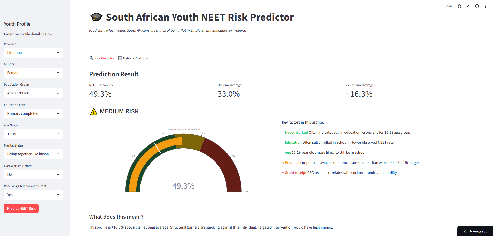
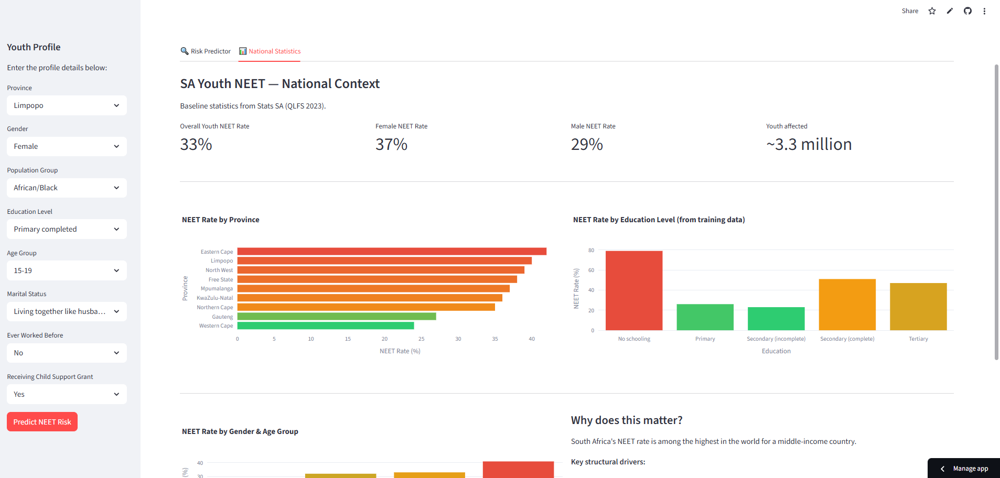
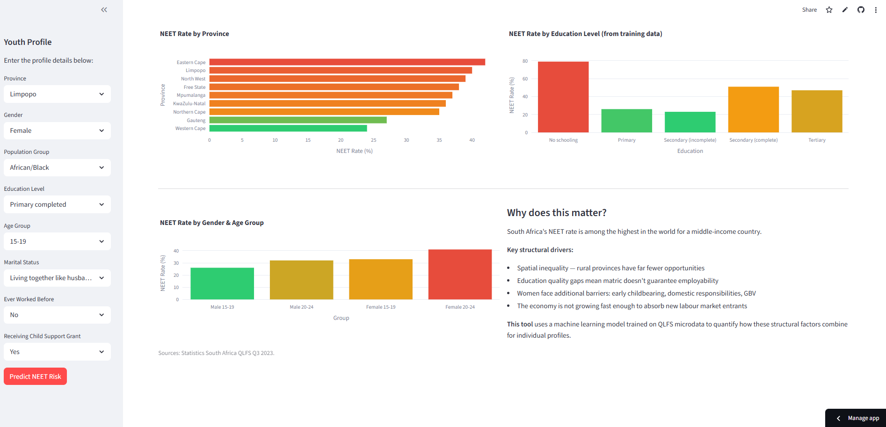

# 🎓 SA Youth NEET Risk Predictor

**[Live Demo](https://sa-youth-unemployment-model-shxlmrm5pckbqkpdxx5hv5.streamlit.app/)**

South Africa has a serious problem — about 33% of young people aged 15-24 are not in employment, education or training. I built this to quantify exactly how socioeconomic factors drive that risk, using real government survey data from Stats SA.

Input a youth profile, get a NEET probability score, see how it compares to the national average, and understand which factors are actually driving the result — based on what the data says, not assumptions.

---

## What it does

- Predicts NEET risk probability for any youth profile
- Compares against the 33% national average
- Explains which factors matter and why — backed by actual survey patterns
- National stats panel showing NEET rates by province, education level, and gender






---

## What I learned building this

The data tells a different story than the conventional wisdom. Work history is by far the strongest predictor — youth who previously worked but aren't currently employed show an 88.8% NEET rate. "Never worked" is actually low risk (32.1%) because most 15-19 year olds who've never worked are still in school. Provincial differences are also much smaller than expected (28-42% range across all 9 provinces).

Getting the model right was only half the work. Making the explanations honest and data-driven was the other half.

---

## Tech

Python · XGBoost · scikit-learn · Streamlit · Plotly · pandas

---

## Data

QLFS microdata from Statistics South Africa — 5 survey years (2019–2023 Q2), ~49,000 youth records aged 15-24. Available at [statssa.gov.za](http://www.statssa.gov.za).

---

## Run locally

```bash
git clone https://github.com/d3rr1ck27/sa-youth-unemployment-model.git
cd sa-youth-unemployment-model
pip install -r requirements.txt
streamlit run app.py
```

---

## Limitations

The model reflects historical patterns in survey data — not causal relationships. It tells you who has been NEET, not necessarily who will be. That distinction matters and I tried to build the explanations with that honesty in mind.

---

**Derrick Love** — BSc Computer Science & Mathematical Statistics, Nelson Mandela University  
[GitHub](https://github.com/d3rr1ck27) · [LinkedIn](https://www.linkedin.com/in/derrick-love-384a1a281)
